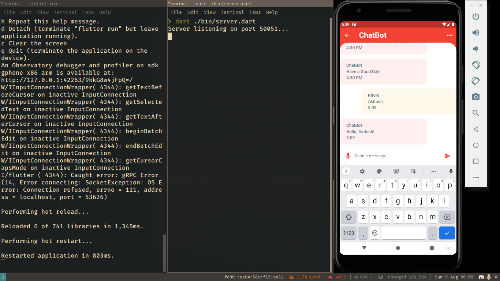

# Mercury
by Bodega-CoderzZz

# Overview
- A Chatbot that can take Audio as Input and connect the user to some service
	* like a telephone operator, but with instant messaging
	* currently, we only have oredering of food, and our app is not connected to any buisness.
	* we do however successfully extract the intent of the user, and this information can be formatted as desired

- For Example : Input -> “I would like to have *1 non veg Pizza* and *2 cokes* from *Dominos*”
- Output ->
```
{
	"intent": "OrderFood",
	"slots": {
		"food_type": [
			"non veg",
			"veg",
			""
			],
	"food_name": [
			"tacos",
			"pizza",
			"cold drinks"
		],
	"qty": [
		"1",
		"three"
	],
	"restaurant_name": "Dominos"
	}
}
```


# Speach to Text with gRPC


- A gRPC-server which takes audio as input from it’s client and sends it to Google-Cloud-Speech API
- The Cloud-Speech API transcribes this audio to text and sends it back to the server
- This text is then sent back to the client.
- The client-server pair has bi-directional stream of data where audio is converted to text in real time and displayed word for word.


# Intent Extraction:
## ALBERT ‘Fine-Tuned’ Model

- ALBERT is a pre-trained model with open-source code which has been trained on BookCorpus (800M Words) and English Wikipedia (2500M Words).
- This pre-trained model has the ability to extract each word’s “contextual meaning” in the text.
- For Example : Order a book.
	Book an order.
- The model can deduce that book in the first sentence is a noun and a subject, and that Book in the second sentence is a verb meaning ‘place an order/make a reservation/appointment’.


- Here, The arrows represent alBERT associating words to their meanings in context with the sentance they are in
- during training alBERT gains experience with associating words with certain tags.
---
## Conditional Random Field (CRF)
- A machine learning method for associating inputs with one of a list of potential features.
- We are going to use this ON-TOP-OF ALBERT.


- CRF does Slot-Identification for each word by mapping the words' possible labels with each other and figuring out which mapping makes the most sense.
- **note : The bold line represents the most probable sequence**


---

## Partially complete Front End with Flutter
- we now have a flutter UI
- the template can now communicate with a simple grpc server and exchange text with it.
- We are yet to connect our ML back-end to our UI, but there's at least smooth connection between the dart grpc server and the flutter client



**NOTICE:** *this repository does not have the credentials required for Google-Cloud-Speech API*

This file is currently incomplete. We will keep updating it as we go.
